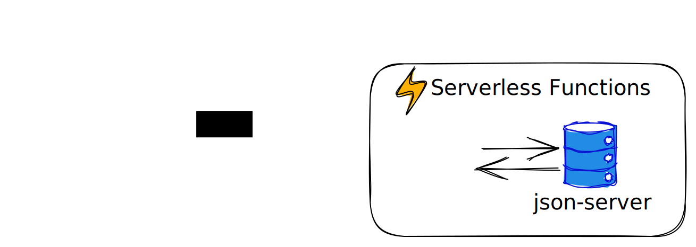

# react-vercel-json-server

포트폴리오용 앱을 배포해야 하지만 AWS, Heroku 등 비용이 발생할 수 있는 플랫폼을 사용하기 원치 않는 분들을 위해 만들었습니다.

Vercel의 Serverless Functions 기능과 json-server의 조합으로 간단한 데이터를 응답하는 API를 만들고 배포할 수 있습니다.

[json-server의 Routes](https://www.npmjs.com/package/json-server#routes) 기능을 응용하면 정해진 범위 내에서 페이지네이션 등의 기능을 이용할 수 있습니다.



## 서버 실행

```bash
npm install
npm start
```

## 배포

```bash
npm run deploy
```